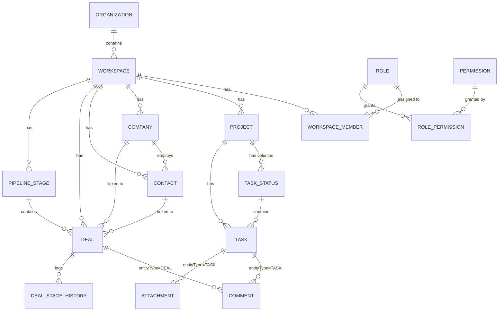
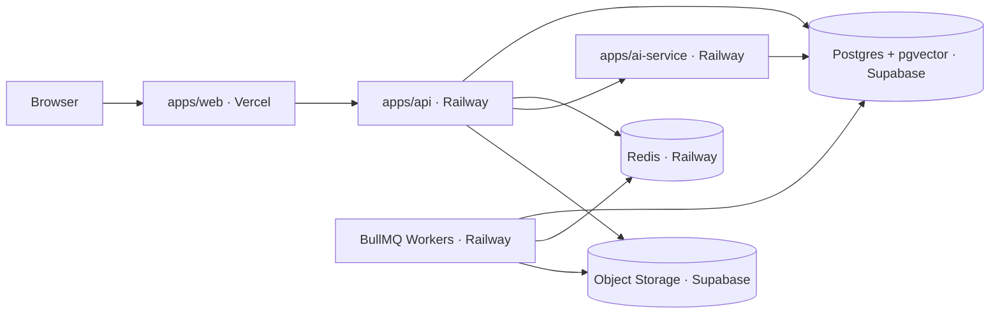

# Phase 0 — Product & Architecture

**Status:** Proposed, pending founder sign-off
**Date:** 2026-07-18

---

## 1. MVP Wedge — Product & First Customer

**This is an assumption, not a fact.** Everything downstream in this document depends on it. Flag it if it's wrong and the rest gets revised, not thrown away.

**Modules:** Core Platform (Auth, Organizations, Workspaces, RBAC) + Work Management (Projects, Tasks, Kanban, Comments, Activity feed) + CRM & Sales (Companies, Contacts, Deals/Pipeline).

**First customer:** A founder-led software studio or venture builder running several concurrent client and internal projects at once — the operator profile NAVICORE itself already fits (multiple ventures, a client-facing engineering practice, work that has to move from "pipeline" to "delivered" without falling through a gap between tools).

**Why this pair, and why this persona:**

- The roadmap already sequences Work Management (Phase 2) before CRM (Phase 3) before Finance (Phase 5) before AI (Phase 6). Rather than invent a new MVP scope, this wedge formalizes *why* that order is correct: it's the smallest slice that's still a complete loop, not two unrelated features.
- A studio/venture-builder persona makes money by converting pipeline into delivered work. Splitting "who owes us what" (CRM) from "what are we actually building for them" (Projects/Tasks) into two disconnected tools — Notion here, a spreadsheet or a separate CRM there — is the exact seam this wedge removes. That's a real, felt pain, not a hypothetical one.
- It's demoable and sellable without AI, billing, or automation. Those are real differentiators later, but none of them are required to prove "this replaces three tools with one" — and building them first would push time-to-first-customer out by months for no proportional increase in believability.
- It's dogfoodable on day one. NAVICORE can run its own portfolio (multiple ventures, client engagements) on this before it's sold to anyone else, which is the cheapest possible source of real usage feedback and the first credible case study.

**What's explicitly deferred, and why that's fine for a wedge:** AI Assistant, Automation builder, Finance/Billing, Knowledge base, Collaboration/chat, Analytics. All of these make the product better; none of them are required to make the core loop (create workspace → run projects → track deals) valuable enough to pay for.

**What would change this:** if the actual first customer NAVICORE has in mind is a different profile — e.g. a single-project team that doesn't have a sales pipeline at all, or an enterprise buyer that cares about SSO/compliance before anything else — the wedge should shift accordingly. This document should be treated as a draft to correct, not a decision already made.

---

## 2. Architecture & Module Boundaries (Phase 0 scope)

Modular monolith, one NestJS deployable (`apps/api`), internal module boundaries enforced by code convention today and by process/service extraction later if a real operational reason shows up (see ADR-004 for why we're not pre-splitting into services).

**Modules in scope for Phase 0/1/2/3:**

| Module | Owns | Notes |
|---|---|---|
| `AuthModule` | Session/identity, wraps Better Auth | Thin — Better Auth does the heavy lifting (see ADR-002) |
| `OrganizationModule` | Organization-level settings, org-level roles | Built on Better Auth's organization plugin |
| `WorkspaceModule` | Workspaces (sub-units of an Organization), workspace membership | Not provided by Better Auth's org plugin — this is NAVICORE's own concept, see schema |
| `RbacModule` | Roles, Permissions, guards/decorators used by every other module | Fine-grained permissions layered on top of Better Auth's coarser org roles |
| `ProjectsModule` | Projects, Kanban columns (`TaskStatus`) | |
| `TasksModule` | Tasks | Depends on `ProjectsModule` through its public service, never through direct Prisma access |
| `CrmModule` | Companies, Contacts, Deals, Pipeline stages | |
| `ActivityModule` | Append-only activity feed / audit trail | Cross-cutting — subscribes to domain events, doesn't get called into directly by business logic |
| `CommentsModule`, `AttachmentsModule` | Comments and attachments on Tasks and Deals | Cross-cutting, polymorphic by `entityType` (see schema note below) |

**Cross-module communication rule:** a module never queries another module's tables directly through Prisma. It calls the owning module's exported service. Example: `TasksModule` needing a workspace's name calls `WorkspaceService.findById()`, it does not `prisma.workspace.findUnique()` from inside `TasksModule`. This is what keeps the "extract into a service later" option genuinely open instead of theoretical.

**Domain events, Phase 0–2:** in-process, via NestJS's `EventEmitter2`. `TasksModule` emits `task.status_changed`, `ActivityModule` listens and writes the audit row; no new infrastructure required. This is intentionally not durable — see `TECH_DEBT.md` #1 for when that becomes a real problem (Phase 7, when Automation triggers need events to survive a process restart and fire across the BullMQ worker boundary, not just in-process).

---

## 3. ER Design

Scope: only the entities needed for Core Platform + Work Management + CRM & Sales. Knowledge/Finance/Automation entities are out of scope until their phases.



`ORGANIZATION`, `USER`, and base `MEMBER`/role concepts are owned by Better Auth's organization plugin and are not hand-modeled here — see `prisma/schema.prisma` header comment and ADR-002.

**Known Prisma limitation — polymorphic associations:** `Comment` and `Attachment` need to attach to either a `Task` or a `Deal`. Prisma can't express a single foreign-key column that targets one of two different tables, so `entityType` + `entityId` are plain indexed columns, not a Prisma relation, and referential integrity for `entityId` is enforced in the application layer (the service validates `entityId` exists in the table `entityType` points to before insert). If this becomes a real data-integrity problem in practice, the fix is splitting into `TaskComment`/`DealComment` — noted in `TECH_DEBT.md`.

Full field-level detail is in `prisma/schema.prisma`, which is the actual source of truth — this diagram is for orientation, not a substitute for reading the schema.

---

## 4. Role / Permission Matrix

Four roles for the MVP wedge: **Owner**, **Admin**, **Member**, **Guest** (client-portal scoped — portal UI itself ships in Phase 3, but the role exists now so permission checks don't need to be retrofitted).

| Permission | Owner | Admin | Member | Guest |
|---|---|---|---|---|
| `org:manage_billing` | ✅ | ❌ | ❌ | ❌ |
| `org:manage_members` | ✅ | ✅ | ❌ | ❌ |
| `org:delete` | ✅ | ❌ | ❌ | ❌ |
| `workspace:create` | ✅ | ✅ | ❌ | ❌ |
| `workspace:manage_settings` | ✅ | ✅ | ❌ | ❌ |
| `projects:create` / `update` / `delete` | ✅ | ✅ | own only | ❌ |
| `projects:manage_members` | ✅ | ✅ | ❌ | ❌ |
| `tasks:create` / `update` / `assign` | ✅ | ✅ | ✅ | ❌ |
| `tasks:delete` | ✅ | ✅ | own only | ❌ |
| `comments:create` | ✅ | ✅ | ✅ | scoped items only |
| `comments:delete_any` | ✅ | ✅ | ❌ | ❌ |
| `crm:companies/contacts:create/update/delete` | ✅ | ✅ | ✅ | ❌ |
| `deals:create` / `update` | ✅ | ✅ | ✅ | ❌ |
| `deals:manage_pipeline_stages` | ✅ | ✅ | ❌ | ❌ |
| `activity:read` | ✅ | ✅ | ✅ | scoped items only |

"Own only" means scoped to records the member created or is assigned to — enforced by `RbacModule` guards checking ownership, not just role.

---

## 5. API Conventions

- **Base path:** `/api/v1`. Versioning is URI-based; additive changes (new optional fields, new endpoints) never bump the version; breaking changes ship as `/api/v2` alongside the old one, not as an in-place change.
- **Resource naming:** plural, kebab-case nouns, nested under their owning resource: `/organizations/:orgId/workspaces/:workspaceId/projects/:projectId/tasks`.
- **Success envelope:** `{ "data": ..., "meta": { ... } }`. `meta` carries pagination info, never business data.
- **Error envelope:** `{ "error": { "code": "VALIDATION_ERROR", "message": "...", "details": [...], "requestId": "..." } }`. `code` is a stable machine-readable string (`VALIDATION_ERROR`, `NOT_FOUND`, `FORBIDDEN`, `UNAUTHORIZED`, `CONFLICT`, `RATE_LIMITED`, `INTERNAL_ERROR`); `requestId` ties back to structured logs/Sentry.
- **Pagination:** cursor-based by default (`?cursor=&limit=`, response `meta.nextCursor`). Offset pagination isn't offered — it doesn't hold up once Automation (Phase 7) is writing rows concurrently with someone paging through a list.
- **Filtering/sorting:** `?filter[status]=active&sort=-createdAt`.
- **Idempotency:** `Idempotency-Key` header supported on all mutating (`POST`/`PATCH`) endpoints starting Phase 1, even though nothing needs it yet. This is the same reasoning as building the command palette into the shell from day one — retrofitting idempotency onto endpoints that already have callers (webhooks, the public API in Phase 7) is much more expensive than shipping the header contract now and having most handlers ignore it until they need it.
- **Auth:** session cookie for `apps/web`; Bearer PAT for the public REST API (Phase 7) and for `apps/ai-service` → `apps/api` calls. Same guard, different strategy, so the authorization logic doesn't fork.

---

## 6. Monorepo Folder Structure

```
navicore-os/
├── apps/
│   ├── web/                       # Next.js 16 (App Router)
│   ├── api/                       # NestJS modular monolith
│   │   └── src/
│   │       ├── modules/
│   │       │   ├── auth/
│   │       │   ├── organizations/
│   │       │   ├── workspaces/
│   │       │   ├── rbac/
│   │       │   ├── projects/
│   │       │   ├── tasks/
│   │       │   ├── crm/
│   │       │   ├── comments/
│   │       │   ├── attachments/
│   │       │   └── activity/
│   │       ├── common/            # guards, interceptors, filters, pipes
│   │       └── main.ts
│   └── ai-service/                # FastAPI — folder exists from Phase 1, implemented Phase 6
├── packages/
│   ├── ui/                        # design tokens + shadcn/ui components
│   ├── types/                     # shared TS types/DTOs/enums (permission keys, entity types)
│   └── config/                    # shared Zod env schemas, eslint/tsconfig bases
├── prisma/
│   └── schema.prisma
├── docs/
│   ├── PHASE_0_ARCHITECTURE.md
│   └── adr/
│       ├── 001-monorepo-tool.md
│       ├── 002-auth-provider.md
│       ├── 003-orm-and-database.md
│       └── 004-hosting-split.md
├── CHANGELOG.md
├── TODO.md
├── TECH_DEBT.md
└── turbo.json
```

Each module folder under `apps/api/src/modules/*` is feature-based internally too (its own controller, service, DTOs, and repository live together), not split across top-level `controllers/`, `services/`, `dtos/` folders.

---

## 7. Deployment Architecture



**Open decision, not yet finalized:** where Postgres itself lives. Supabase (same vendor as Storage, native `pgvector`, one bill/dashboard for both) vs. Railway's managed Postgres (one vendor for API/workers/AI-service/DB, simpler private networking). Default assumption for this document is **Supabase Postgres**, mainly because Storage is already there and native `pgvector` support removes a step — see ADR-004. This is flagged in `TODO.md` and `TECH_DEBT.md` as something to confirm before Phase 1's Docker Compose / CI provisioning is written, since it changes connection-string handling and local dev setup.

---

## 8. Coding Standards

- **TypeScript:** strict mode on everywhere, no implicit `any`, no non-null assertions (`!`) without an inline comment justifying it.
- **Lint/format:** ESLint (`typescript-eslint` + Nest/Next-specific rule sets) + Prettier, both enforced in CI and via a Husky pre-commit hook (`lint-staged`).
- **Commits:** Conventional Commits (`feat:`, `fix:`, `refactor:`, `docs:`, `test:`, `chore:`) — this is what lets `CHANGELOG.md` eventually be generated instead of hand-maintained.
- **Branching:** trunk-based, short-lived feature branches off `main`, PR required, CI green + at least one review before merge, squash-merge.
- **Testing:** unit tests for domain/application logic (Vitest), integration tests for module boundaries and Prisma repositories against a real test database, e2e for the critical flows only (Playwright for `apps/web`, Supertest for `apps/api`). Coverage is a signal, not a target — domain/application layers should be well-covered; generated glue code doesn't need to hit an arbitrary percentage.
- **Config:** all environment variables validated at boot via a Zod schema in `packages/config`; the app fails fast on missing/invalid config instead of failing on first use. `.env.example` stays in sync with the schema.
- **Naming:** `PascalCase` for classes/types, `camelCase` for variables/functions, kebab-case filenames except Nest's own convention files (`*.module.ts`, `*.controller.ts`, `*.service.ts`). Named exports by default; default exports only where the framework requires them (Next.js `page.tsx`/`layout.tsx`).
- **No magic strings:** permission keys, entity types, error codes — all live as enums/constants in `packages/types`, shared by `apps/web` and `apps/api`.

---

## 9. Phase 0 Acceptance Criteria

- [ ] MVP wedge (persona + 3 modules, Section 1) reviewed and either confirmed or corrected
- [ ] Module boundaries (Section 2) and the "no cross-module direct Prisma access" rule agreed
- [ ] ER diagram + `prisma/schema.prisma` skeleton reviewed — no migration run against a real database yet
- [ ] Role/permission matrix (Section 4) reviewed
- [ ] API conventions (Section 5) — versioning, error shape, pagination — agreed
- [ ] Monorepo folder structure (Section 6) agreed
- [ ] All 4 ADRs in `docs/adr/` reviewed and moved from Proposed → Accepted
- [ ] Deployment architecture (Section 7) agreed, including the open Postgres-hosting decision
- [ ] Coding standards (Section 8) agreed
- [ ] `CHANGELOG.md`, `TODO.md`, `TECH_DEBT.md`, `docs/adr/` exist in the repo (done as of this commit)
- [ ] Explicit founder/CTO sign-off to open the Phase 1 gate
